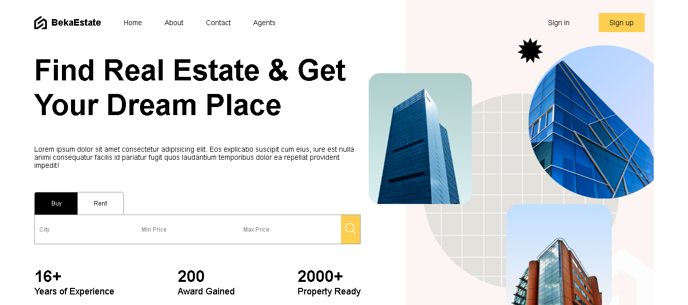
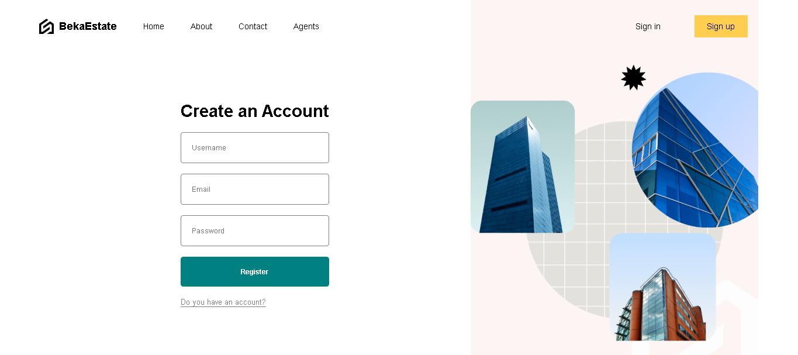
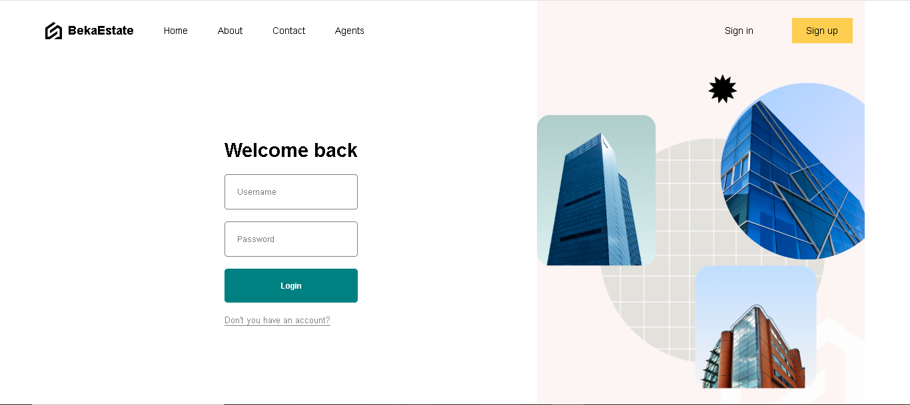
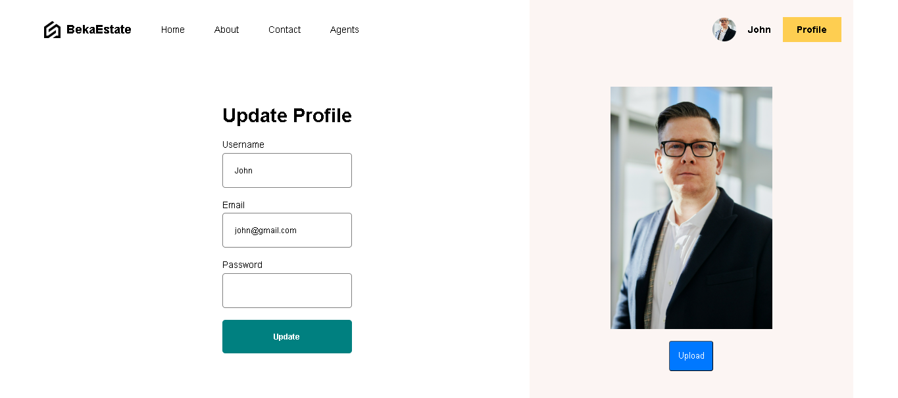
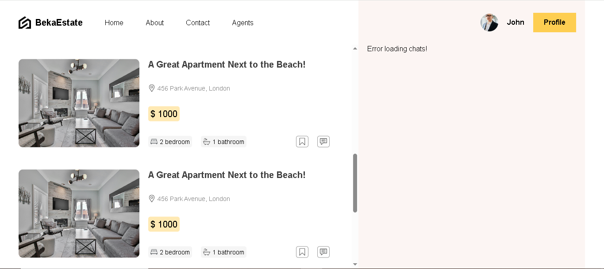
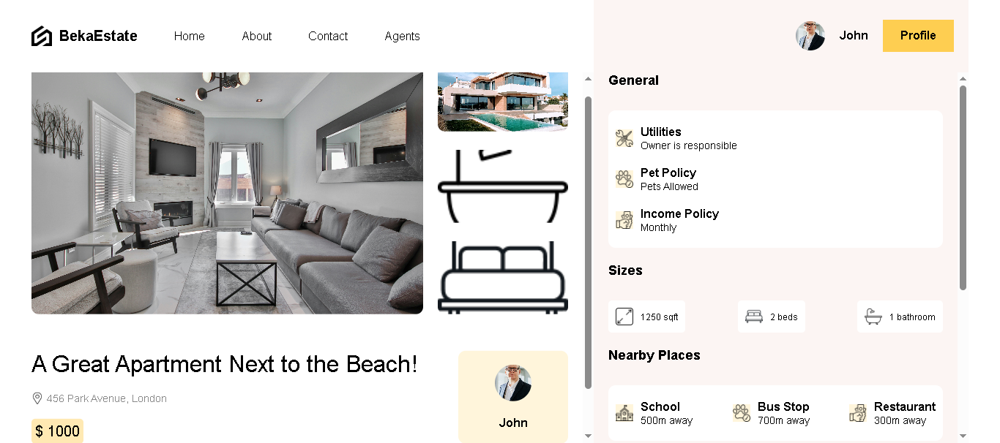
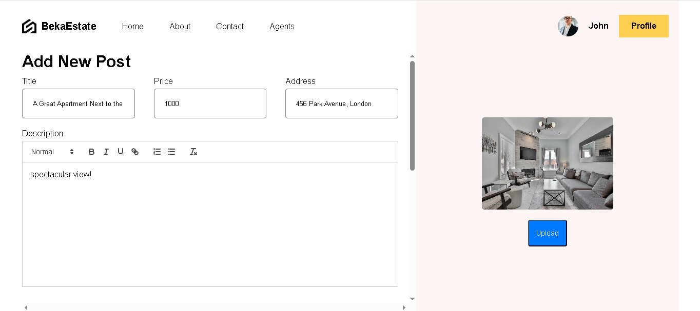

<h1 align='center'>Realstate App</h1>



<h2>Demo</h2>

🔥 [Live Demo](https://b3reketab.github.io/realstate-app/)

<h2>Built with</h2>

<h3>Front-End</h3>

- React
- SaaS

<h3>Back-End</h3>

- Node.js
- Express
- MongoDB
-  Prisma, JWT, Cookies, Context API

</br>

<h2>Features</h2>

Homepage – A clean, modern landing page promoting property search by city, price, and category (Buy/Rent).

Authentication – Users can sign up and log in via beautifully designed login and registration screens.

User Profile – Users can update their profile information and upload avatars for personalization.

Add Property Post – Authenticated users can add new listings with title, price, address, description, and image upload.

Rich Text Editor – Description input uses a full-featured WYSIWYG editor for formatting text.

Property Listings – Displays all posted properties in a card-based layout with preview image, price, and features.

Property Details Page – Shows full details of a selected property including utilities, pet policies, size, and nearby locations.

</br>

<h2>Screenshots</h2>










<h2>Development</h2>

Here are the steps to start the project locally.

1. Clone the repository.

```sh
HTTPS - $ git clone https://github.com/b3reketab/realstate-app.git
or
SSH - $ git clone git@github.com:b3reketab/realstate-app.git
```

2. Move to the cloned directory.

```sh
$ cd realstate-app
```

3. Install the dependencies.

```sh
$ npm i
or
$ yarn
```

4. Start the project.

```sh
$ npm start
or
$ yarn start
```
